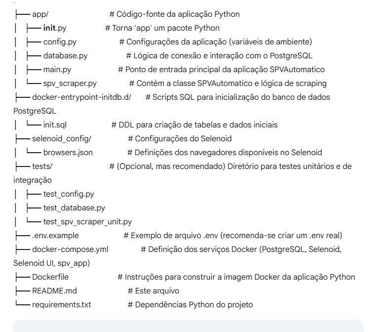

# Desafio Técnico: Sistema de Consulta de Pesquisas de Tribunal Jurídico (SPV)

## Visão Geral

Este projeto é uma aplicação Python desenvolvida para automatizar a consulta de pesquisas em plataformas de tribunais jurídicos no Brasil. Ele utiliza Selenium para interagir com interfaces web e persiste os dados das pesquisas em um banco de dados PostgreSQL. A solução é completamente conteinerizada usando Docker e Docker Compose, garantindo um ambiente de execução isolado e reproduzível, incluindo um hub Selenoid para gestão de navegadores.

## Utilitário

O objetivo principal desta aplicação é otimizar o processo de coleta de informações jurídicas, consultando automaticamente plataformas de tribunais. Ele gerencia o ciclo de vida das pesquisas, desde a entrada dos dados até a conclusão da coleta, registrando os resultados no banco de dados.

## Funcionalidades Principais

* **Automação de Web Scraping:** Utiliza Selenium para navegar e extrair informações de websites de tribunais.
* **Gestão de Sessões de Navegador:** Integração com Selenoid para gerenciar e executar navegadores remotos de forma eficiente e escalável.
* **Persistência de Dados:** Armazena e gerencia dados de pesquisa, clientes e resultados em um banco de dados PostgreSQL.
* **Conexão Robusta com Banco de Dados:** Possui um mecanismo de retentativas de conexão ao PostgreSQL.
* **Ambiente Conteinerizado:** Todo o ambiente (aplicação, banco de dados, Selenoid e sua UI) é orquestrado via Docker Compose.
* **Configuração via Variáveis de Ambiente:** Facilita a configuração do banco de dados e do Selenoid.

## Estrutura do Projeto


## Tecnologias Utilizadas

Este projeto faz uso das seguintes tecnologias e ferramentas:

* **Linguagens de Programação:**
    * Python 3.9+

* **Banco de Dados:**
    * PostgreSQL

* **Conteinerização e Orquestração:**
    * Docker
    * Docker Compose

* **Automação Web e Testes:**
    * Selenium WebDriver (para automação de navegadores)
    * Selenoid (para execução escalável e isolada de navegadores em contêineres)
    * `unittest` (módulo de testes padrão do Python)
    * `pytest` (ferramenta de testes de terceiros, se instalada e utilizada)
    * `pytest-mock` (plugin para `pytest`, se instalado e utilizado para mocks)

* **Bibliotecas Python (Gerenciadas via `requirements.txt`):**
    * `psycopg2-binary`: Driver para conexão com PostgreSQL.
    * `selenium`: API para interação com navegadores web.
    * `tqdm`: Para exibir barras de progresso (se aplicável na aplicação).
    * `python-dotenv`: Para carregar variáveis de ambiente de um arquivo `.env`.
      
## Instalação e Configuração

Siga os passos abaixo para configurar e rodar a aplicação:

1.  **Clone o Repositório:**
    ```bash
    git clone [https://github.com/tiorosenweiss/desafio-fidelity.git](https://github.com/tiorosenweiss/desafio-fidelity.git)
    cd desafio-fidelity
    ```

2.  **Crie o Arquivo de Variáveis de Ambiente:**
    Crie um arquivo `.env` na raiz do projeto (no mesmo nível de `docker-compose.yml`) e preencha com as variáveis necessárias. Use o `.env.example` como guia:

    ```bash
    # .env
    DB_HOST=postgres
    DB_USER=usr_teste
    DB_PASSWORD=teste
    DB_NAME=db_teste
    SELENOID_HUB_URL=http://selenoid:4444/wd/hub
    ```
    *Obs: `DB_HOST` deve ser `postgres` quando rodando dentro do Docker Compose, pois `postgres` é o nome do serviço do banco de dados definido no `docker-compose.yml`.*

3.  **Construa e Inicie os Serviços Docker:**
    Execute o Docker Compose para construir as imagens e subir todos os contêineres:

    ```bash
    docker-compose up --build -d
    ```
    * O `--build` garante que a imagem da sua aplicação (`spv_app`) seja construída a partir do `Dockerfile`.
    * O `-d` (detached mode) executa os contêineres em segundo plano.

4.  **Verifique o Status dos Serviços:**
    Você pode verificar o status dos contêineres com:

    ```bash
    docker-compose ps
    ```
    Aguarde até que o serviço `postgres` esteja `healthy` e `selenoid` e `spv_app` estejam `running`.

## Uso da Aplicação

Após todos os serviços estarem em execução:

* A aplicação `spv_app` (definida no `docker-compose.yml`) iniciará automaticamente o `main.py` após o PostgreSQL e o Selenoid estarem prontos.
* A lógica principal da aplicação `SPVAutomatico` será executada, buscando pesquisas pendentes no banco de dados e realizando as consultas automatizadas.

Para acompanhar a execução e os logs da aplicação:

```bash
docker-compose logs -f spv_app

